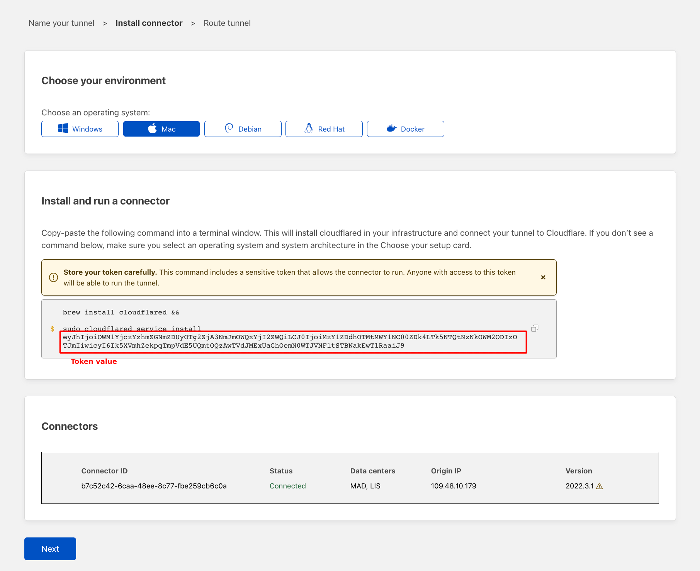
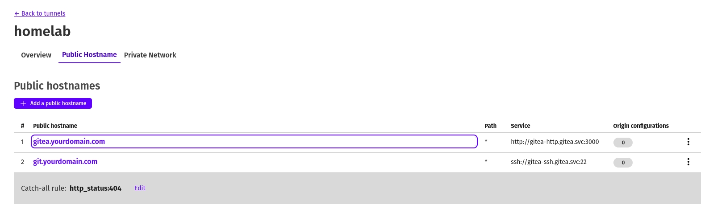

# Homelab
## The story
After working with Kubernetes for a year, I think it's time to build a cluster at home. There are so many GitHub repositories or youtube tutorials out there that I could use and instantly start. But doing it myself from scratch is more valuable for me. So I created this repo.
## Prerequisites
- cmake (aka make)
- kubectl
- helm3
- helmfile
## Deploy nodes
### Master node
```bash
make run-master
```
After the master node started, you will see a `kube_config` file in the root, copy this file to `<home_path>/.kube/config` on your computer for managing the cluster later.
### Worker node
Before start your worker node, first create the `.env` file at the root directory with the following format
```bash
# The master node IP is the IP of the machine that you run master node on it
K3S_URL=https://<your_master_node_ip>:6443
# The token value could be found at /var/lib/rancher/k3s/server/token
K3S_TOKEN="<your_token_value>"
```
Then run your worker node
```bash
make run-worker
```
## Deploy workloads
### Update configurations
#### Cloudflare
I don't have a static IP address at home, so the best choice until now is CloudFlare Tunnel - it's fast and free. In my experience with CloudFlare Tunnel, the speed is pretty quick if you want to publish a blog, or in my friend's use case, the media server can stream with a buffer time around seconds. You can learn how to create your tunnel [here](https://developers.cloudflare.com/cloudflare-one/connections/connect-apps/install-and-setup/tunnel-guide/remote/). After you created your tunnel, get the token value like the image below and decode it with base64.

You will have structure like this when decode the token value
```json
{
    "a":"...", // this is account tag
    "t":"...", // this is tunnel ID
    "s":"..." // this is tunnel secret
}
```

Go to `k8s/base/cloudflared/values.yaml` and update your tunnel informations.
#### Gitea (under testing)
Gitea will be exposed to the internet by using CloudFlare Tunnel. Unfortunately, default port 22 is not supported ([read more here](https://developers.cloudflare.com/fundamentals/get-started/reference/network-ports/)), then we need to work around with `~/.ssh/config` file.

First of all, update your config in `k8s/workloads/gitea/values.yaml`. For example, ssh domain is `git.yourdomain.com` and gitea domain is `gitea.yourdomain.com`, we will have `~/.ssh/config` like this
```
Host git.yourdomain.com
    ProxyCommand /usr/local/bin/cloudflared access ssh --hostname %h
```
Please note that your need to change `/usr/local/bin/cloudflared` path match the path on your machine.

Finally, update your tunnel public hostnames and you're good to go


#### Deploy base workloads
After finishing the configuration part, use these commands to deploy base workloads for our cluster. These workloads will be the backbone for the entire cluster, they are including monitoring, cert manager, tunnel, ...
```bash
# Move to k8s/base directory
cd k8s/base
# Run deploy script
./deploy.sh
```
#### Deploy workloads
Finally after base workloads has been deployed, you can deploy your workloads. This `workloads` directory will be the place that you put all of your k8s applications.
```bash
# Move to k8s/workloads directory
cd k8s/workloads
# Run deploy script
./deploy.sh
```
## Note
Currently, the script to deploy the k8s cluster still not convenient. I'm still working to make it more friendly and easy to use.
## TODOs
- [ ] Add more default applications like Gitea, ArgoCD, Tekton,...
- [ ] Use global yaml config instead of manual update config at beginning
- [ ] Ansible for server setup
- [ ] Support PXE boot for OS install
## License
This repository was published under MIT license. Take a look at `LICENSE` file for more detail.
